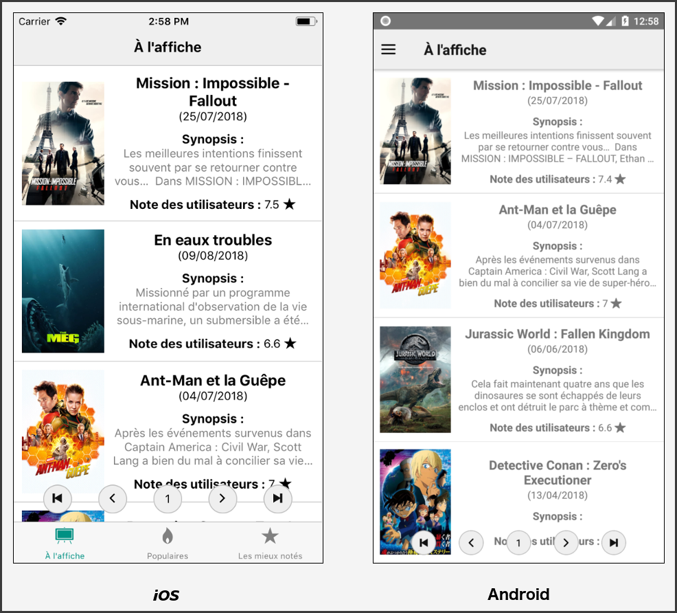

# Étape 3 - Navigation native Android et iOS

## Architecture

Ce dossier reprend ce qui a été fait dans l'étape 2.

Dans le dossier *src*, nous avons rajouté :

- Un fichier *DrawerContainer.js* dans lequel vous écrirez le code du drawer Android.

- Une méthode *getPopular* permettant de récupérer la liste des films les plus populaires.

- Une méthode *getTopRated* permettant de récupérer la liste des films les mieux notés.

- Le style complet que nous avons utilisé pour la correction de cette étape.

## Objectif

Le but de cette étape est de modifier la navigation pour qu'elle s'adapte à la plateforme sur laquelle nous sommes. En effet, les utilisateurs Android n'ont pas les mêmes habitudes de navigation que les utilisateurs iOS. Les utilisateurs Android sont habitués au menu hamburger qui se déroule en appuyant sur le bouton en haut à gauche. Les utilisateurs iOS sont habitués à la navigation par la barre d'icône en bas de l'application. 

Pour qu'il y ai besoin d'une telle navigation, il faut rajouter des écrans. Nous allons donc réutiliser notre composant MovieList mais selon le type d'écran, il affichera une liste différente :

- l'écran est de type 1, il affichera la liste des films à l'affiche
- l'écran est de type 2, il affichera la liste des films les plus populaires
- l'écran est de type 3, il affichera la liste des films les mieux notés

Voici ce que vous allez obtenir à la fin de cette étape :

- Une barre de navigation sur iOS
- Un hamburger menu sur Android




## C'est parti !

En React Native, lorsque l'on veut faire un fichier particulier pour Android et un autre pour iOS, il suffit de le nommer respectivement **.android.js** et **.ios.js** .

Dans notre cas, nous voulons faire un fichier de navigation différent pour chaque plateforme. Il faudra donc remplacer notre fichier *AppNavigation.js* par un fichier *AppNavigation.android.js* et un fichier *AppNavigation.ios.js*

Pour commencer, dupliquez le fichier *AppNavigation.js* et renommez simplement les deux fichier de façon à avoir *AppNavigation.android.js* et *AppNavigation.ios.js*.

### iOS

Dans le fichier *AppNavigation.ios.js*, supprimez le code de la constante Stack :

```javascript
const Stack = createStackNavigator(
  {
    MovieList: {
      screen: MovieList,
      navigationOptions: () => {
        return {
          headerTitle: "À l'affiche"
        };
      }
    },
    MovieDetail: {
      screen: MovieDetail,
      navigationOptions: ({ navigation }) => {
        return {
          headerTitle: navigation.state.params.item.title
        };
      }
    }
  },
  {
    navigationOptions: () => ({
      headerTintColor: "black"
    }),
    initialRouteName: "MovieList"
  }
);
```

et remplacez le par une fonction permettant de créer des StackNavigator en passant en paramètre le nom de l'écran principal ainsi que le type de l'écran :

```javascript
const createStack = (listTitle, type) => {
  return createStackNavigator(
    {
      MovieList: {
        screen: MovieList,
        navigationOptions: () => {
          return {
            headerTitle: listTitle
          };
        }
      },
      MovieDetail: {
        screen: MovieDetail,
        navigationOptions: ({ navigation }) => {
          return {
            headerTitle: navigation.state.params.item.title
          };
        }
      }
    },
    {
      navigationOptions: () => ({
        headerStyle: {backgroundColor: '#efefef'},
        headerTintColor: "black",
      }),
      initialRouteParams: {type},
      initialRouteName: "MovieList"
    }
  );
}
```

Grâce à la ligne ```initialRouteParams: {type}```, pour chaque StackNavigator créé par cette fonction, l'écran initial disposera du type dans ses paramètres de navigation.

Ensuite créez trois StackNavigator : 

```javascript
const NowPlayingStack = createStack("À l'affiche", 1);
const PopularStack = createStack("Populaires", 2);
const TopRatedStack = createStack("Les mieux notés", 3);
```

Vous allez maintenant créer un TabNavigator composé des trois stack que vous venez de créer : 

```javascript
const TabNavigator = createBottomTabNavigator(
  {
    NowPlaying: {
      screen: NowPlayingStack,
      navigationOptions: () => {
        return {
          header: null,
          title: "À l'affiche",          
        }
      }
    },
    Popular: { 
      screen: PopularStack, 
      navigationOptions: () => {
        return {
          header: null,
          title: 'Populaires',          
        }
      }
    },
    TopRated: {
      screen: TopRatedStack,
      navigationOptions: () => {
        return {
          header: null,
          title: 'Les mieux notés',          
        }
      }
    },
  },
  {
    navigationOptions: ({ navigation }) => ({
      tabBarIcon: ({ focused, tintColor }) => {
        const { routeName } = navigation.state;
        let iconName;
        if (routeName === 'NowPlaying') {
          iconName = `ios-easel`;
        } else if (routeName === 'Popular') {
          iconName = `ios-flame`;
        } else if (routeName === 'TopRated') {
          iconName = `ios-star`;
        }
        return <Ionicons name={iconName} size={25} color={tintColor} />;
      },
    }),
    tabBarOptions: {
      activeTintColor: '#009183',
      inactiveTintColor: 'gray',
    },
    animationEnabled: false,
    swipeEnabled: false,
  }
);
```

Il ne reste plus qu'à retourner le TabNavigator lors du rendu du composant AppNavigation.

Enfin modifiez le composant MovieList pour qu'il récupère la bonne liste selon le type d'écran sur lequel on est.

### Android

Dans le fichier *AppNavigation.android.js*, supprimez le code de la constante Stack. Et écrivez une fonction permettant de créer un écran "liste de film".

```javascript
const createList = listTitle => {
  return (
    {
      screen: MovieList,
      navigationOptions: ({navigation}) => {
        return {
          headerTitle: listTitle,
          headerLeft: <IconFeather 
                        name='menu' 
                        color='black' 
                        size={24} 
                        style={{paddingLeft: 10}}
                        onPress={() => {
                            navigation.openDrawer()
                        }}
                      />
        };
      }
    }
  );
}
```

Ensuite créez un StackNavigator contenant un écran **NowPlaying**, **Popular** et  **TopRated** qui seront créés par la fonction **createList()**. Il faut également qu'il contienne l'écran **MovieDetail**.

Toute la navigation se fera à l'intérieur de cette stack et donc l'initialRoutePrams qu'il faut fournir correspond au type du premier écran de la stack.

Une fois votre StackNavigator créé, il vous suffit de l'utiliser dans un DrawerNavigator et de retourner le DrawerNavigator dans la méthode render du composant AppNavigation.

```javascript
const DrawerNavigator = createDrawerNavigator(
  {
    Stack: VotreStackNavigator
  },
  {
    contentComponent: DrawerContainer,
    initialRouteName: "Stack",
  }
);
```

Il ne vous reste plus qu'une chose à faire, il faut compléter le composant DrawerContainer. Il doit au minimum contenir 3 boutons qui permettent de naviguer vers leurs écrans respectifs.
