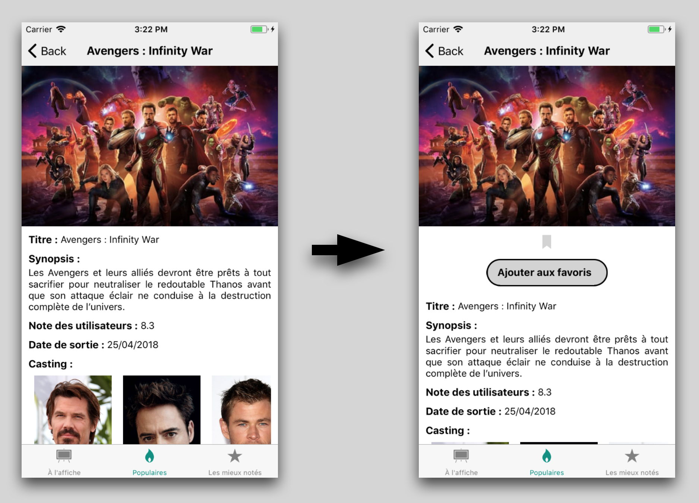

# Étape 4 - Redux, Persistance des données, Éjection et Accès aux images du device

## Architecture


## Objectif

Le but de cette étape est d'ajouter un store redux et persister le store pour retrouver nos données entre deux lancements de l'application.
Pour utiliser le store, nous allons ajouter un écran de consultation des favoris.
Nous allons également éjecter l'application afin d'utiliser la librairie React Native Image Picker pour accéder aux images et à l'appareil photo du device.


## C'est parti !

### Redux

Commençez par ajouter les librairies **redux** et **react-redux**.

Ensuite créez un dossier **store** dans le dossier **src** et créez les sous-dossiers **reducers** et **actions**.

### Premier reducer

Créez un fichier **favorites.js** dans le dossier reducers. Ce fichier va contenir le reducer qui va nous permettre de gérer la liste des favoris dans le store.

La première étape est d'indiquer l'état par défaut de notre reducer :

```javascript
const defaultState = {
  movies: [],
};
```

Puis d'exporter notre reducer :

```javascript
export default favorites = (state = defaultState, action) => {
  let nextState
  switch (action.type) {
      //TODO
  default:
    return state
  }
}
```

Ajoutez le cas **TOGGLE_FAVORITE** dans le switch case qui va gérer l'ajout et la suppression d'un film dans la liste des favoris. Si le film que l'on souhaite ajouter n'est pas présent dans le state, on l'ajoute, sinon on le supprime.

Créez ensuite un fichier **index.js** dans le dossier reducers et exportez le reducer. Nous allons anticiper l'ajout d'autres reducers en utilisant combineReducers : 

```javascript
import { combineReducers } from 'redux';
import favorites from './favorites';

export default rootReducer = combineReducers({
    favorites
});
```

### Première action

Créez un fichier **favorites.js** dans le dossier **actions** qui va exporter la fonction **toggle** :

```javascript
export const toggle = (movie) => {
    const action = { type: "TOGGLE_FAVORITE", value: movie }
    return action;
};
```

Créez ensuite un fichier **index.js** dans le dossier actions et exportez les actions du fichier favorites :

```javascript
export * as favorites from './favorites';
```

### Création du store

Dans le dossier store, créez le fichier index.js que l'on va appeler pour créer notre store :

```javascript
import { createStore } from 'redux';
import rootReducer from './reducers';

export const store = createStore(rootReducer);
```

Ensuite modifiez le fichier App.js pour qu'il distribue le store à l'application :

```javascript
import React, { Component } from 'react';
import AppNavigation from './src/navigation/AppNavigation';
import { Provider } from 'react-redux';
import { store } from './src/store';

export default class App extends Component {
  render() {
    return (
      <Provider store={store}>
        <AppNavigation />
      </Provider>
    );
  }
}
```

### Utilisation du store

Nous allons maintenant permettre d'ajouter des films à la liste des favoris en modifiant le composant **MovieDetail**.

Premièrement, connectez le composant au store en ajoutant ce code à la fin du fichier :

```javascript
const mapStateToProps = store => {
  return {
      favorites: store.favorites.movies,
  }
};

export default connect(mapStateToProps)(MovieDetail);
```

Vous devrez faire cette étape pour tous les composants qui ont besoin des données du store.

Pensez à enlever l'export de MovieDetail au début du fichier. Ensuite, nous allons ajouter une icône indiquant si le film est  dans les favoris ou non, ainsi qu'un bouton permettant d'ajouter ou retirer le film des favoris.

Ajoutez ces éléments au dessus du titre et ajoutez une variable isFavorite dans le render qui permet de savoir si le film fait déjà parti des favoris.

Vous devriez obtenir ce résultat :



Il faut maintenant que le bouton mette à jour notre store. Pour cela, récupérez les actions redux que vous avez défini précédement :

```javascript
import * as Actions from "./store/actions";
```

Et définissez la fonction toggleFavorite qui va mettre à jour le store :

```javascript
toggleFavorite = () => {
    const {item} = this.props.navigation.state.params;
    const { dispatch } = this.props;
    dispatch(Actions.favorites.toggle(item));
}
```

Donc maintenant que l'on peut ajouter des favoris, ajoutez une icône dans le composant **Movie** permettant de savoir que le film est dans les favoris sans avoir à aller dans le détail du film (vous pouvez mettre cette icône entre la date de sortie et le synopsis).

Nous allons également rajouter un écran permettant de visualiser la liste des films favoris. Ce composant est déjà créé et est nommé **Favorites**. Servez vous de vos connaissances de l'étape 3 pour ajouter ce composant à la navigation.

Maintenant que nous pouvons accéder à cet écran, nous allons pouvoir le compléter. Pour le moment, il affiche une image cliquable et dispose d'une fonction updateAvatar. Ces éléments serviront pour la suite de l'étape, ne vous en préoccupez pas pour le moment. Faites en sorte d'afficher la liste des favoris en dessous de l'image et affichez un message du type "Vous n'avez aucun favoris" si la liste est vide.

Ensuite nous allons ajouter la possibilité de vider la liste des favoris d'un coup. Commencez par ajouter une action redux nommée *clear* permetant cela. Cette action sera déclenchée depuis un bouton à droite du titre de navigation. Il va donc falloir ajouter un headerRight à l'écran Favorites. Ce headerRight est définit dans les navigationOptions comme le headerTitle que nous avons utilisé. Ajoutez donc ce bouton :

```javascript
headerRight: <TouchableOpacity onPress={() => {navigation.state.params && navigation.state.params.clearFavorites && navigation.state.params.clearFavorites()}} style={{padding: 10}}>
              <Ionicons name={`ios-trash`} color={'black'} size={25}/>
            </TouchableOpacity>
```

Lors de l'appui sur le bouton, on appel la fonction clearFavorites qui est dans les paramètres de navigation. Cette fonction doit être définie par le composant Favorites et ajoutée aux paramètres lors de la construction du composant. De cette façon, la navigation ne gère pas les données de notre application. Par sécurité on vérifie que la fonction existe bien avant de l'appeler.

Il faut donc maintenant définir cette fonction dans le constructeur de **Favorites** :

```javascript
navigation.setParams({
    clearFavorites: () => { /* Appel de l'action redux */ }
});
```

### Persister le store

Maintenant les favoris sont gérés dans l'application. Cependant lorsque l'on ferme l'application et qu'on la réouvre, le store redux est remis à zéro et l'on perd tous les favoris. Nous allons voir comment sauvegarder le store pour qu'il soit conservé entre deux ouvertures de l'application grâce à la librairie **redux-persist**.

Commencez par ajouter la librairie **redux-persist**, ensuite modifiez le fichier **index.js** du dossier **store** de cette façon :

```javascript
import { createStore } from 'redux';
import { persistStore, persistReducer } from 'redux-persist';
import storage from 'redux-persist/lib/storage';

import rootReducer from './reducers';

const persistConfig = {
    key: 'root',
    storage,
};

const pReducer = persistReducer(persistConfig, rootReducer);

export const store = createStore(pReducer);
export const persistor = persistStore(store);
```

Il suffit ensuite d'englober l'application avec PersistGate dans le fichier App.js :

```javascript
import React, { Component } from 'react';
import AppNavigation from './src/navigation/AppNavigation';
import { Provider } from 'react-redux';
import { PersistGate } from 'redux-persist/lib/integration/react';
import { store, persistor } from './src/store';

export default class App extends Component {
  
  render() {
    return (
      <Provider store={store}>
        <PersistGate loading={null} persistor={persistor}>
          <AppNavigation />
        </PersistGate>
      </Provider>
    );
  }
}
```

### Éjection de l'application

Nous allons maintenant ajouter la possibilité de modifier son avatar en le sélectionnant dans la galerie du téléphone ou en prenant une photo directement. Pour réaliser ceci, nous allons utiliser la librairie **react-native-image-picker** qui nécessite d'éjecter l'application.

L'éjection de l'application va mettre à disposition les parties natives de notre appli dans les dossiers ios et android. Ceci va nous permettre d'ajouter de nouvelles librairies contenant du code natif et qu'il est nécessaire de lier à notre projet, ce que nous ne pouvons pas faire tant que l'application est encapsulée par Expo.

Nous allons maintenant éjecter notre projet en exécutant la commande ```yarn eject```. Choisissez l'option **_React Native: I'd like a regular React Native project_**, entrez le nom de l'application : **_React Native Workshop_** puis saisissez le nom de projet pour Android Studio / Xcode : **_reactnativeworkshop_**.
Voilà votre projet est éjecté. Maintenant ajoutez la librairie **react-native-image-picker**.

### react-native link

Cette librairie nécessite d'être liée au projet. Pour la lier, vous avez deux possibilités : 

- ```react-native link``` qui va lier toutes les dépendances de votre projet ayant besoin d'être liées.
- ```react-native link react-native-image-picker``` qui va lier seulement la librairie *react-native-image-picker*.

Après l'éjection du projet, je vous conseille de lancer ```react-native link``` qui va s'assurer que toutes vos dépendances soient liées si elles le nécessitaient.

### Permissions

Certaines librairies nécessitent des permissions pour accéder aux composants du téléphone. Le plus souvent les permissions nécessaires sont indiquées dans la documentation de la librairie (c'est le cas pour la librairie React Native Image Picker).

Sur iOS, ajoutez ces lignes dans le fichier **ios/reactnativeworkshop/Info.plist** :
```plist
<plist version="1.0">
  <dict>
    ...
    <key>NSPhotoLibraryUsageDescription</key>
    <string>$(PRODUCT_NAME) souhaite accéder à votre galerie d'image</string>
    <key>NSCameraUsageDescription</key>
    <string>$(PRODUCT_NAME) souhaite utiliser l'appareil photo</string>
    <key>NSPhotoLibraryAddUsageDescription</key>
    <string>$(PRODUCT_NAME) souhaite sauvegarder des photos dans votre galerie d'image</string>
  </dict>
</plist>
```

Sur Android, ajoutez ces lignes dans le fichier **android/app/AndroidManifest.xml** :
```xml
<uses-permission android:name="android.permission.CAMERA" />
<uses-permission android:name="android.permission.WRITE_EXTERNAL_STORAGE"/>
```

### Mise à niveau

Pour Android, nous allons augmenter le niveau d'API de l'application car à partir d'août 2018, les nouvelles applications doivent cibler Android 8.0 (niveau d'API 26) au minimum. 

Donc dans le fichier *android/app/build.gradle*, montez les versions de : 
- compileSdkVersion : ```compileSdkVersion 26```
- buildToolsVersion : ```buildToolsVersion "26.0.2"```
- targetSdkVersion : ```targetSdkVersion 26```
- com.android.support:appcompat-v7 : ```compile "com.android.support:appcompat-v7:26.0.2"```

Gradle doit être au minimum en version 4.1, augmentez la version en allant dans le fichier *android/gradle/wrapper/gradle-wrapper.properties* et remplacez la ligne **distributionUrl** par :
```
distributionUrl=https\://services.gradle.org/distributions/gradle-4.1-all.zip
```

Pour finir, remplacez le code du fichier *android/build.gradle* par :
```gradle
buildscript {
    repositories {
        jcenter()
        maven {
            url 'https://maven.google.com/'
            name 'Google'
        }
    }
    dependencies {
        classpath 'com.android.tools.build:gradle:3.0.0'
        classpath 'com.google.gms:google-services:4.0.0'
    }
}

allprojects {
    repositories {
        mavenLocal()
        jcenter()
        maven {
            url "$rootDir/../node_modules/react-native/android"
        }
        maven {
            url 'https://maven.google.com/'
            name 'Google'
        }
    }
}
```

### Modification de l'avatar

Suite à l'éjection, si vous voyez un warning apparaître dans votre application, c'est parce que React Native évolue. Certaines fonctions deviennent obsolètes et c'est le cas de la fonction "isMounted" utilisée par React Navigation. Pour cacher ce warning, vous pouvez ajouter dans le fichier App.js :

```javascript
...
import { store, persistor } from './src/store';

console.ignoredYellowBox = ['Warning: isMounted(...) is deprecated'];

export default class App extends Component {
...
```

Vous pourrez enlever ce code lorsque React Navigation aura mis à jour sa librairie.

Maintenant que notre application fonctionne comme avant, nous pouvons revenir à la modification de l'avatar.

Pour que notre avatar soit disponible dans toute l'application et qu'il soit sauvegardé nous allons le stocker dans le store.

Créez un reducer nommé user qui va contenir notre avatar (qui sera par défaut égal à ```require('../../assets/defaultPic.png')```) et qui va permettre de mettre à jour sa valeur avec le cas **UPDATE_AVATAR**.

Ajoutez le dans le fichier index.js de la même manière que favorites et créez une action user.

Exportez user dans le fichier index.js de la même manière que favorites.

Maintenant que notre avatar se trouve dans le store, mettez à jour **DrawerContainer** ainsi que **Favorites** pour que leur avatar ait comme source l'avatar du store.

Nous allons ensuite utiliser **ImagePicker** de react-native-image-picker dans la fonction **updateAvatar** du composant **Favorites** :

```javascript
updateAvatar = () => {
    ImagePicker.showImagePicker({
      title:'Sélectionnez votre avatar', 
      takePhotoButtonTitle: 'Prendre une photo ...',
      chooseFromLibraryButtonTitle: 'Choisir depuis la galerie ...',
      cancelButtonTitle: 'Annuler'
    }, (response) => {
      if (response.didCancel) {
        console.log('Canceled');
      }
      else if (response.error) {
        Alert.alert(`Nous n'avons pas pu importer votre image`);
      }
      else {
        // Appel de l'action updateAvatar
      }
    })
  }
```

Enfin testez le bon fonctionnement de cette fonctionnalité.
