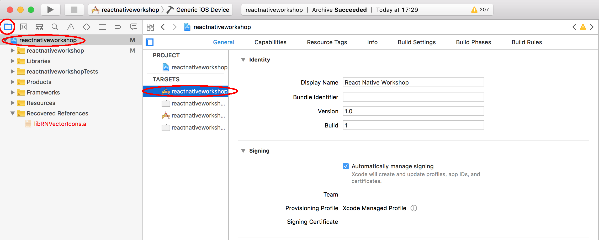

# Étape 5 - Création d'un apk et d'un ipa

## Android

Pour distribuer votre application sur Android, vous aurez besoin de générer un apk signé.

Générez un keystore avec la commande :

```
keytool -genkey -v -keystore keystore_release.jks -alias rnworkshop -keyalg RSA -keysize 2048 -validity 10000
```

Placez le fichier ```keystore_release.jks``` dans le dossier ```android/app```. Editez le fichier ```android/gradle.properties``` avec les mots de passe que vous avez utilisé à la génération du keystore :

```
MYAPP_RELEASE_STORE_FILE=keystore_release.jks
MYAPP_RELEASE_KEY_ALIAS=rnworkshop
MYAPP_RELEASE_STORE_PASSWORD=*****
MYAPP_RELEASE_KEY_PASSWORD=*****
```

Editez le fichier ```android/app/build.gradle``` :

```gradle
...
android {
    ...
    defaultConfig { ... }
    signingConfigs {
        release {
            if (project.hasProperty('MYAPP_RELEASE_STORE_FILE')) {
                storeFile file(MYAPP_RELEASE_STORE_FILE)
                storePassword MYAPP_RELEASE_STORE_PASSWORD
                keyAlias MYAPP_RELEASE_KEY_ALIAS
                keyPassword MYAPP_RELEASE_KEY_PASSWORD
            }
        }
    }
    buildTypes {
        release {
            ...
            signingConfig signingConfigs.release
        }
    }
}
...
```

Dans le fichier ```package.json```, ajoutez le script :
```json
{
  ...
  "scripts": {
    ...
    "build-android": "cd android && ./gradlew assembleRelease"
  },
  ...
}
```

Maintenant il vous suffit de lancer ```yarn build-android``` pour générer votre apk. L'apk généré se trouvera dans le dossier ```android/app/build/outputs/apk/release```.

Cependant pour le moment il existe un bug qui fait échouer la création de l'apk. En attendant que le bug soit résolu, il suffit de rajouter la ligne ```android.enableAapt2=false``` dans le fichier ```android/gradle.properties``` pour que la création de l'apk se passe sans problème.

## iOS

Pour pouvoir distribuer votre application vous aurez besoin d'un compte ayant souscrit au **Apple Developer Program**.

Ouvrez votre projet dans Xcode en sélectionnant le fichier ```ios/reactnativeworkshop.xcodeproj```. Puis ouvrez la fenêtre de configuration de l'application comme ceci :



Renseignez le **Bundle Identifier** dans la partie **Identify** puis sélectionnez votre équipe de développement dans la partie **Signing**.

Vérifiez que l'appareil sélectionné (en haut à gauche) est bien "Generic iOS Device" puis allez dans Product -> Archive. Une archive va être générée et vous pourrez alors déployer votre application en cliquant sur le bouton "Upload to AppStore..."